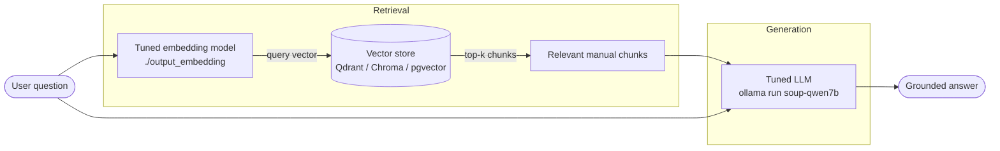

# Fine-tune an LLM & Create Your Own Embedding Model

Local fine-tuning pipelines running entirely on a consumer laptop GPU (RTX 4080 Laptop, 12 GB VRAM, Windows 11), built with [Soup](https://github.com/MakazhanAlpamys/Soup) (`soup-cli`, Apache-2.0), a CLI-first fine-tuning tool. The files in this repo (configs, scripts, docs) are MIT-licensed.

**New to all of this? Start with the [step-by-step beginner walkthrough](docs/getting-started.md)** — hardware requirements, copy-paste commands, and runtime estimates for every stage.

Two guides, sharing one environment setup:

| Guide | What you get |
|---|---|
| **[Fine-tune an LLM](docs/finetune-llm.md)** | A chat model tuned on your instruction data: Qwen2.5-7B-Instruct → QLoRA SFT → GGUF → Ollama |
| **[Fine-tune an embedding model](docs/finetune-embedding.md)** | A domain-tuned retriever for RAG from a folder of PDFs: MinerU extraction → VLM screenshot captions → contrastive pairs → BGE |

They're complementary: the embedding model retrieves the right doc chunks, the LLM answers over them.

## Architecture

How the two trained models work together at answer time (RAG):



The embedding model guarantees the right manual text is in context; the LLM turns it into an answer in your domain's voice. Each guide below has its own training-architecture diagram.

## What hardware do you need?

| GPU | What works |
|---|---|
| **12 GB+ NVIDIA** (RTX 3060 12GB, 4070, 4080 laptop) | Everything, comfortably |
| **8 GB NVIDIA** (3060 Ti, 4060) | Everything with the shipped small-batch settings — the 7B QLoRA run peaks at 7.3 GB, so close other GPU apps |
| **4–6 GB NVIDIA** | Embedding pipeline works (use MinerU `-b pipeline`); for the LLM use a small model or Soup's layer-streaming (8B has been trained on a 4 GB card, ~1.4× slower) |
| **No NVIDIA** | PDF extraction runs on CPU; training realistically needs a GPU — consider a cloud rental for those steps |

Plus 16–32 GB RAM and 60–150 GB free disk (one-time model downloads are 15–40 GB).

## Time & capacity at a glance

Rough figures on a 12 GB card; first runs are slower (model downloads). Run GPU stages one at a time.

| Stage | Pipeline | GPU memory | Speed |
|---|---|---|---|
| PDF extraction (MinerU) | embedding | ~8 GB (or ~4 GB / CPU with `-b pipeline`) | ~500–1,500 pages/hour |
| Screenshot captioning (qwen3-vl:8b) | embedding | ~6 GB | 5–15 s per image |
| Pair / Q&A generation (qwen2.5:7b) | both | ~5 GB | 5–15 s per chunk |
| Embedding training (BGE-base) | embedding | ~2–4 GB | 10–30 min |
| Embedding eval (tuned vs base) | embedding | ~2 GB | minutes |
| LLM QLoRA training (Qwen2.5-7B) | LLM | 7.3 GB measured | ~1–2 h per 1,000 examples × 3 epochs |
| GGUF export + Ollama import | LLM | CPU/RAM mostly | 20–30 min |

**How many PDFs per run?** No hard limit — MinerU processes a folder sequentially; the constraints are time and disk (extracted output ≈ the PDFs' own size). Validate the whole pipeline on **one PDF first**, then batch — 50 manuals is an overnight run. One 300-page manual through the full embedding path ≈ **2–4 hours**, almost all unattended; the LLM path is ~2–4 hours on top once you have data.

## Setup (Windows 11, NVIDIA GPU)

Soup requires Python >=3.10,<3.13.

```bash
winget install Python.Python.3.12
py -3.12 -m venv .venv
.venv\Scripts\activate

# CUDA torch first (plain pip torch can be CPU-only on Windows)
pip install torch --index-url https://download.pytorch.org/whl/cu126

# Soup from the genuine upstream
git clone https://github.com/MakazhanAlpamys/Soup.git
pip install -e "Soup[train]"

soup doctor   # everything must be green
```

> Note: install Soup only from the upstream URL above — at least one malicious clone of it has circulated on GitHub offering a malware "download zip". A pip-installed project never needs a release zip.

Versions that worked: `soup-cli 0.73.3`, `torch 2.13.0+cu126`, `transformers 5.16.1`, `trl 0.29.1`, `peft 0.20.0`, `bitsandbytes 0.50.2`.

Then pick your guide: **[LLM fine-tuning](docs/finetune-llm.md)** or **[embedding fine-tuning](docs/finetune-embedding.md)**.

## Windows gotchas hit along the way

- **`batch_size: auto` hard-OOMs**: Soup's auto batch probe can crash with `cudaErrorMemoryAllocation` on Windows/WDDM instead of backing off. Use a fixed `batch_size`.
- **Relative paths in configs** resolve against the shell's cwd — use absolute paths in `data.train` and `output`.
- **`soup train` prompts for confirmation** — pass `--yes` in scripts/CI.
- **`soup infer` loads fp16** (no 4-bit option), so a 7B won't fit in 12 GB for inference — use `scripts/verify_adapter.py` or the exported GGUF instead.
- **transformers 5.x**: `apply_chat_template(..., return_tensors="pt")` returns a dict — pass `return_dict=True` and take `["input_ids"]`.

## Repo contents

| Path | What |
|---|---|
| `docs/finetune-llm.md` | LLM fine-tuning guide (QLoRA SFT → GGUF → Ollama) |
| `docs/finetune-embedding.md` | Embedding fine-tuning guide (PDF → RAG) |
| `configs/soup_qwen7b.yaml` | Qwen2.5-7B QLoRA SFT config |
| `configs/quickstart_soup.yaml` | TinyLlama smoke-test config |
| `configs/soup_embedding.yaml` | Embedding-model fine-tune config |
| `scripts/caption_images.py` | Splice VLM descriptions of screenshots into extracted Markdown |
| `scripts/build_pairs.py` | Chunk Markdown → anchor/positive/negative pairs (+ optional SFT rows) |
| `scripts/eval_embedder.py` | Recall@k / MRR comparison: tuned embedder vs base |
| `scripts/verify_adapter.py` | 4-bit + LoRA adapter generation sanity check |
| `data/test_prompts.jsonl` | Prompts for inference sanity checks |
| `tests/` | Unit tests for the pipeline scripts (network mocked) |
| `Modelfile` | Ollama import file for the exported GGUF |

Model weights, adapters, and GGUF files are git-ignored (multi-GB).

## Development

The pipeline scripts are stdlib-only (no pip installs to run them). Quality gates:

```bash
pip install -e ".[dev]"
pytest            # unit tests — Ollama calls are mocked, no server needed
ruff check scripts/ tests/
pylint scripts/ tests/
deptry .
```

Not used on purpose: `uvloop` (no async code, and it's Linux-only), OpenTelemetry (single-machine CLI scripts — stderr progress logging is the right size; add tracing only if these ever run as a service).

## License

MIT — see [LICENSE](LICENSE). Soup itself is Apache-2.0, © its authors.
