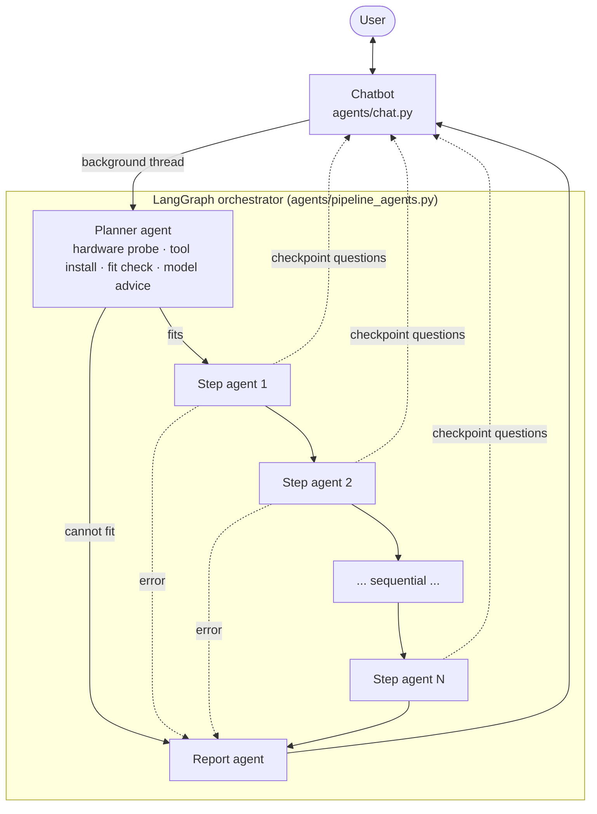

# Agents & chatbot (zero-command mode)

The easiest way to run either pipeline: a **chatbot guides you**, a **planner agent
checks your machine**, and **LangGraph worker agents run every stage sequentially in
the background**. You only answer questions — no commands to remember.

```bash
pip install langgraph
python agents/chat.py
```

## What the chatbot does

1. Asks whether you want **smart PDF search** (embedding model) or **your own chat
   model** (LLM fine-tune).
2. Tells you to **copy your PDFs into the `pdfs/` folder** (or points at your
   training JSONL for the LLM path) and waits until they're there.
3. **Checks your hardware** — GPU, VRAM, RAM, disk — and your installed tools.
   Fixable problems (a CPU-only PyTorch, a missing pip package, a missing Ollama
   model) it **fixes itself after asking you once**; admin-level problems (GPU
   driver, closing other GPU apps) it hands to you as exact instructions.
4. **Advises which base model fits your machine** and lets you pick — the
   recommendation, another from the list, or any Hugging Face id — then writes a
   run config (`configs/chat_<pipeline>.yaml`) with your choice baked in.
5. **Explains every step in plain language** (what happens, how long it takes,
   where you'll be asked to check something) before anything runs.
6. Launches the agents **in a background thread** and only interrupts you at
   **human-in-the-loop checkpoints**: approve the extracted text, the generated
   training pairs, the eval scores (embedding) or the test generations (LLM).

Interrupted or rejected runs are safe: finished stages auto-skip on the next run.

## Architecture



The step agents wrap the **exact same Step objects** as the one-command scripts
(`scripts/run_embedding_pipeline.py`, `scripts/run_llm_pipeline.py`), so a chat
run, an agent CLI run, and a manual run all behave identically.

## Running the agents without the chatbot

```bash
python agents/run_agents.py embedding --pdfs pdfs/            # with checkpoints
python agents/run_agents.py embedding --sft --auto-install    # + install missing tools
python agents/run_agents.py llm --data data/sft_train.jsonl --name my-model
python agents/run_agents.py llm --auto                        # fully unattended
```

`--auto` removes the human checkpoints (everything is approved); `--auto-install`
lets the planner pip-install / `ollama pull` what's missing.

## The planner's fit rules

| Machine | Embedding pipeline | LLM pipeline |
|---|---|---|
| ≥ 8 GB VRAM | full plan (vlm backend) | 7B QLoRA |
| 4–8 GB | MinerU switched to `pipeline` backend automatically | 6–8 GB: borderline 7B with warnings; below: **planner refuses** and lists options (small base, layer streaming, cloud) |
| No GPU | CPU extraction (slow), warns about caption/question speed | planner refuses with options |

## Files

| Path | What |
|---|---|
| `agents/chat.py` | The chatbot (start here) |
| `agents/pipeline_agents.py` | LangGraph graphs: planner → sequential step agents → report |
| `agents/graph_common.py` | Hardware probe, fit rules, model recommendations, GPU troubleshooting |
| `agents/run_agents.py` | Agent runner CLI (no chat) |
