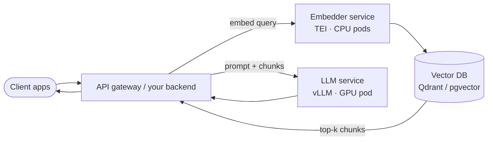

# Production deployment (local artifacts → cloud)

Both pipelines end in **portable artifacts** — nothing ties them to the machine that trained them:

| Artifact | What it is | Size |
|---|---|---|
| `./output_embedding` | Hugging Face model folder (tuned BGE) | ~0.4 GB (bge-base) |
| `./output_qwen7b` + exported GGUF | LoRA-merged LLM | ~4.7 GB (q4_K_M) / ~15 GB (fp16) |

Move them like any files: copy the folder, `aws s3 cp` / `az storage blob upload` / `gsutil cp`, or push to a **private** Hugging Face repo (`huggingface-cli upload yourname/your-model ./output_embedding`). Version them like build outputs — tag each with the data + config that produced it.

## 1. Using the embedding model somewhere else (standalone)

The tuned embedder is useful entirely on its own — any RAG stack, search service, or app can use it without the LLM.

**Option A — inside your app (simplest):**

```python
from sentence_transformers import SentenceTransformer
model = SentenceTransformer("./output_embedding")   # or "yourname/your-model" from HF
vectors = model.encode(["how do I create a revision rule?"])
```

Works on CPU — bge-base is ~110M params, single-digit milliseconds per query on a modern CPU core. For most internal tools you don't need a GPU at all.

**Option B — as a dedicated inference service (production):** run [Text Embeddings Inference](https://github.com/huggingface/text-embeddings-inference) (TEI, Apache-2.0) — the standard server for BGE-family models, with an OpenAI-compatible `/v1/embeddings` API:

```bash
docker run -p 8080:80 -v ./output_embedding:/model \
  ghcr.io/huggingface/text-embeddings-inference:cpu-latest --model-id /model
```

(GPU images exist for high throughput; [Infinity](https://github.com/michaelfeil/infinity) (MIT) is a good alternative.) Your applications then call it over HTTP exactly like the OpenAI embeddings API — no Python dependency in the caller.

**Hardware for embedding serving:** CPU-only handles ~hundreds of queries/sec for bge-base; one small GPU (T4/L4) takes you to thousands and speeds up bulk indexing ~10×. This is the cheapest component in the stack — don't over-provision it.

## 2. Using the fine-tuned LLM somewhere else

The q4_K_M GGUF runs anywhere Ollama or llama.cpp runs (`ollama create` on the target machine, same as locally). For serious concurrency, serve the **merged HF model** (`soup merge` output or the pre-GGUF folder) with [vLLM](https://github.com/vllm-project/vllm) — OpenAI-compatible API, continuous batching:

```bash
docker run --gpus all -p 8000:8000 -v ./merged_model:/model \
  vllm/vllm-openai --model /model --max-model-len 4096
```

Rule of thumb for a 7B: **Ollama/llama.cpp (q4)** needs ~6–8 GB VRAM and suits ≤ a few concurrent users; **vLLM (fp16/AWQ)** wants 20+ GB VRAM and serves many users efficiently.

## 3. Cloud GPU sizing (AWS / Azure / GCP)

| Need | GPU class | AWS | Azure | GCP |
|---|---|---|---|---|
| Embedding serving / bulk indexing | CPU or T4/L4 | c7i / g4dn.xlarge (T4 16 GB) | D-series / NCas_T4_v3 | n2 / g2-standard-4 (L4 24 GB) |
| 7B LLM, q4, light traffic | T4 16 GB | g4dn.xlarge | NCas_T4_v3 | n1 + T4 |
| 7B LLM, vLLM fp16, real traffic | A10G / L4 / L40S 24–48 GB | g5.xlarge (A10G) / g6.xlarge (L4) / g6e (L40S) | NVads_A10_v5 | g2-standard-8 (L4) |
| QLoRA training in the cloud (if your laptop can't) | 24 GB | g5.xlarge | NVads_A10_v5 | g2-standard-8 |
| 13–70B models / heavy training | A100/H100 40–80 GB | p4d / p5 | NC_A100_v4 / NCads_H100_v5 | a2 / a3 |

Notes that save money: the embedding service almost never needs its own GPU; spot/preemptible instances are fine for *training* (Soup resumes with `--resume`) but not for serving; one 24 GB GPU comfortably serves a 7B **and** hosts the embedder side-by-side for small deployments.

## 4. Kubernetes

Prerequisite on every cloud: GPU-enabled node pool + the NVIDIA device plugin (EKS: GPU AMI or the GPU Operator; AKS: `--node-vm-size Standard_NC...` GPU pool; GKE: `--accelerator type=nvidia-l4` or Autopilot GPU pods). Then GPUs are requested like any resource.

**Embedder (TEI) — CPU deployment, scale horizontally:**

```yaml
apiVersion: apps/v1
kind: Deployment
metadata: { name: embedder }
spec:
  replicas: 2
  selector: { matchLabels: { app: embedder } }
  template:
    metadata: { labels: { app: embedder } }
    spec:
      containers:
        - name: tei
          image: ghcr.io/huggingface/text-embeddings-inference:cpu-latest
          args: ["--model-id", "/model"]
          ports: [{ containerPort: 80 }]
          resources: { requests: { cpu: "2", memory: 4Gi }, limits: { cpu: "4", memory: 8Gi } }
          volumeMounts: [{ name: model, mountPath: /model }]
          readinessProbe: { httpGet: { path: /health, port: 80 } }
      volumes:
        - name: model
          persistentVolumeClaim: { claimName: embedder-model }   # or an initContainer that pulls from HF/S3
```

**LLM (vLLM) — one GPU per replica:**

```yaml
apiVersion: apps/v1
kind: Deployment
metadata: { name: llm }
spec:
  replicas: 1
  selector: { matchLabels: { app: llm } }
  template:
    metadata: { labels: { app: llm } }
    spec:
      nodeSelector: { cloud.google.com/gke-accelerator: nvidia-l4 }   # cloud-specific label
      containers:
        - name: vllm
          image: vllm/vllm-openai:latest
          args: ["--model", "/model", "--max-model-len", "4096"]
          ports: [{ containerPort: 8000 }]
          resources: { limits: { nvidia.com/gpu: 1, memory: 24Gi } }
          volumeMounts: [{ name: model, mountPath: /model }]
          readinessProbe:
            httpGet: { path: /health, port: 8000 }
            initialDelaySeconds: 120    # model load takes minutes
      volumes:
        - name: model
          persistentVolumeClaim: { claimName: llm-model }
```

Scaling and operations, the short version:

- **Embedder scales horizontally** (HPA on CPU) — replicas are cheap and stateless.
- **LLM scales by whole GPUs** — one replica per GPU; scale replicas, not resources. Queue depth / tokens-per-second, not CPU, is the autoscaling signal (KEDA or custom metrics).
- **Model delivery**: bake the model into the image (immutable, big), or PVC + init-container pulling from S3/Blob/GCS/HF (flexible). Never download from the public internet at pod start in production.
- **Vector DB**: run Qdrant/pgvector next to the embedder (Qdrant has an official Helm chart); embed and index once per document version.
- **Security**: keep both services cluster-internal (ClusterIP), put your API gateway in front, and require auth — a fine-tuned model can leak its training data if exposed raw.

## 5. The full production picture



Local development (this repo, Ollama) and production (TEI + vLLM on Kubernetes) use the **same two artifacts** — promotion is copying files, not retraining.
