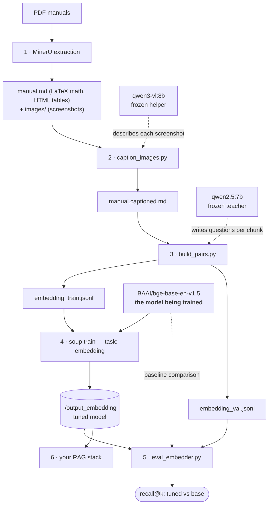

# Fine-tune an embedding model (PDF → RAG)

Turn a folder of PDFs (e.g. enterprise software manuals or product documentation) into a domain-tuned sentence-embedding model, and **measure** that it beats the base model. Best used for retrieval (RAG): the tuned embedder finds the right manual chunks, and an LLM answers over them. Complete the [environment setup](../README.md#setup-windows-11-nvidia-gpu) first.

The stack (all local, fits 12 GB VRAM):

```
PDFs → MinerU (Markdown + LaTeX math + images)
     → caption_images.py (VLM describes screenshots)
     → build_pairs.py (chunk + generate anchor/positive/negative JSONL)
     → soup train (BGE fine-tune)
     → eval_embedder.py (tuned vs base recall)
```

### One command (or zero)

Every step below runs in order via one script — finished stages auto-skip, `--from-step X` resumes, `--dry-run` previews:

```bash
python scripts/run_embedding_pipeline.py --pdfs pdfs/   # or: python agents/chat.py
```

Zero-command mode: the [chatbot + agents](agents.md) guide you through the same pipeline conversationally with human-in-the-loop checkpoints.

## Architecture



Solid arrows are the data path; dotted arrows are frozen models assisting a step.

### Which model does what

Four models appear in this pipeline, but **only one is being trained** — the rest are frozen helpers:

| Model | Role | Trained? |
|---|---|---|
| MinerU's internal models | Read the PDFs (layout, OCR, formulas) | No — extraction tool |
| `qwen3-vl:8b` (Ollama) | Describe screenshots as text | No — helper |
| `qwen2.5:7b` (Ollama) | Write the training questions ("teacher") | No — helper |
| **`BAAI/bge-base-en-v1.5`** | **The embedding model — this is what gets fine-tuned** | **Yes** |

The result in `./output_embedding` is a modified copy of BGE: same architecture and size, but its weights are adjusted (via LoRA, then merged) so that *your* domain's questions land close to the chunks that answer them in vector space. The helpers are never modified and aren't needed at serving time — in production you run only the tuned BGE.

## 0. One-time prerequisites

```bash
pip install "mineru[core]"
ollama pull qwen3-vl:8b     # vision model for screenshot captions (needs Ollama ≥ 0.12.7)
ollama pull qwen2.5:7b      # text model for question generation
```

## 1. Extract the PDFs with MinerU

[MinerU](https://github.com/opendatalab/MinerU) beats naive text extraction (pypdf) on everything that matters for technical docs: Markdown output with **math as LaTeX**, **tables as HTML**, correct reading order, and **embedded images/screenshots extracted to files** with references linked in the Markdown. It OCRs scanned pages automatically. Native Windows, Python 3.10–3.12 (3.13 breaks), ~8 GB VRAM for the high-accuracy VLM backend:

```bash
mineru -p pdfs/ -o extracted/ -b vlm-transformers
```

(First run downloads the models. `-b pipeline` is the lighter classic backend — ~4 GB VRAM or CPU. Point `-p` at a single PDF or a folder.)

Each PDF becomes a folder under `extracted/` containing a `.md` file and an `images/` directory.

Fallbacks: `soup data ingest manual.pdf` (pypdf, text-only — fine for simple prose PDFs); [Docling](https://github.com/docling-project/docling) (IBM, MIT-licensed) if strict licensing matters — slightly weaker math fidelity.

## 2. Caption screenshots

MinerU extracts UI screenshots as files but doesn't describe them. [`scripts/caption_images.py`](../scripts/caption_images.py) sends every referenced image to Qwen3-VL (Apache-2.0, trained for GUI/screen understanding) and splices the description into the Markdown right after the image reference — making screenshots searchable text. It also transcribes any formulas it sees as LaTeX:

```bash
python scripts/caption_images.py extracted/manual/auto/manual.md
```

Writes `manual.captioned.md` next to the input. Re-runnable: already-captioned images are skipped, so an interrupted run resumes where it stopped. Run it per extracted Markdown file (loop over them in a shell `for` loop for many PDFs).

Math in the *text* needs no extra step — MinerU already emits LaTeX, and embedding/LLM models understand LaTeX natively.

## 3. Generate training pairs

[`scripts/build_pairs.py`](../scripts/build_pairs.py) chunks the (captioned) Markdown by headings, then asks a local Ollama text model to write questions each chunk answers. Every `(question, chunk)` becomes an anchor/positive pair; negatives are sampled from *other* documents:

```bash
python scripts/build_pairs.py extracted/ --output-dir data/
```

Output:

- `data/embedding_train.jsonl` — `{"anchor", "positive", "negative"}` rows
- `data/embedding_val.jsonl` — held-out 10% for the evaluation in step 5

Useful knobs: `--questions-per-chunk 3` (more data per chunk), `--max-chunk-chars` (default 3000 ≈ fits BGE's 512-token window), `--model` (any Ollama text model). It automatically prefers `.captioned.md` files over the raw ones.

**Bonus for the [LLM guide](finetune-llm.md):** add `--sft` and it also writes `data/sft_train.jsonl` (alpaca format — the model answers each question from its chunk), giving you domain Q&A data for `task: sft` from the same pass.

Rule of thumb: aim for **1,000+ pairs** before expecting a measurable win; a few hundred PDF pages with 2 questions/chunk usually gets there.

## 4. Train with Soup

[configs/soup_embedding.yaml](../configs/soup_embedding.yaml) already points at `./data/embedding_train.jsonl`:

```bash
soup train --config configs/soup_embedding.yaml --yes
```

Key settings: base `BAAI/bge-base-en-v1.5` (~110M params — minutes per epoch at full precision), `task: embedding`, `format: embedding`, `embedding_loss: contrastive` (InfoNCE; alternatives: `triplet` with `embedding_margin`, or `cosine`), `embedding_pooling: mean`. The adapter-merged model lands in `./output_embedding`.

**Picking a different base model** — change `base:` in the config (and pass the same id as `--base` to `eval_embedder.py` in step 5 so the comparison stays fair):

| Base | When to pick it |
|---|---|
| `BAAI/bge-base-en-v1.5` (default) | English docs, fastest to train, smallest to serve |
| `BAAI/bge-large-en-v1.5` | Same family, ~3× bigger — a few recall points better, still trains in well under an hour |
| `BAAI/bge-m3` | Multilingual docs and/or long chunks (8k-token window vs 512) |

Whatever you pick, that exact model is the one being fine-tuned — the questions/captions helpers above stay the same.

## 5. Evaluate: did fine-tuning actually help?

Never ship an embedder unmeasured. [`scripts/eval_embedder.py`](../scripts/eval_embedder.py) retrieves each held-out question against all chunks and compares Recall@k / MRR for base vs tuned:

```bash
pip install sentence-transformers
python scripts/eval_embedder.py data/embedding_val.jsonl --tuned ./output_embedding
```

```
     model    recall@1    recall@5   recall@10         mrr
      base       0.412       0.701       0.792       0.531
     tuned       0.538       0.845       0.901       0.662   ← what you want to see
```

If tuned ≤ base: usually too few pairs (step 3 — generate more questions per chunk), or the val questions are near-duplicates of train (regenerate with a different `--seed`).

## 6. Use the tuned embedder

The output is a Hugging Face model directory — no GGUF/Ollama step; load it in your RAG stack:

```python
from sentence_transformers import SentenceTransformer
model = SentenceTransformer("./output_embedding")
vectors = model.encode(["How do I create a new design revision?"])
```

Point your vector store (Chroma, Qdrant, pgvector, …) at it and index the same chunks from step 3 (`build_pairs.py`'s chunking is deterministic — rerun it or reuse the positives).

**If screenshot-centric queries still retrieve poorly** even with captions: consider late-interaction *visual* retrieval (ColPali-style — e.g. [ColModernVBERT](https://github.com/illuin-tech/modernvbert), 250M params, MIT), which embeds page images directly and skips extraction loss entirely — at the cost of replacing the text-vector design (needs a multi-vector-capable store like Qdrant ≥ 1.10). And if the answering LLM sits behind a reranker, prefer a local one (a BGE reranker; Soup can fine-tune `task: reranker`) over cloud rerank APIs when the docs are confidential.
