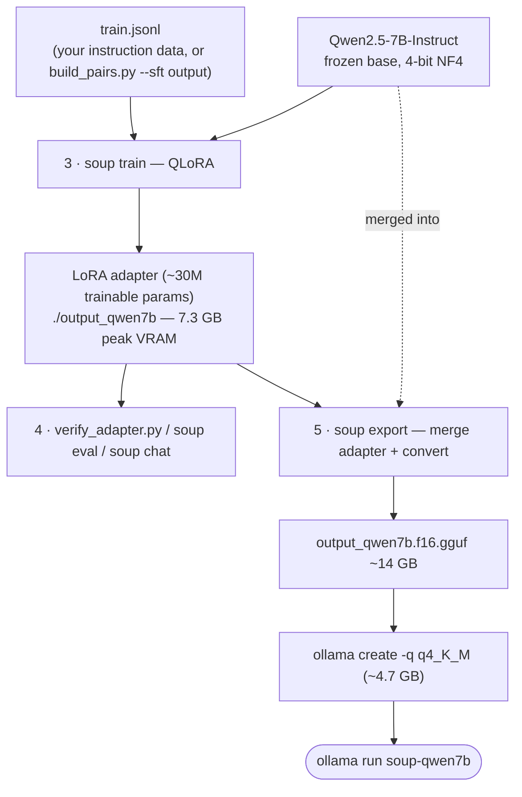

# Fine-tune an LLM (QLoRA SFT → GGUF → Ollama)

Fine-tune a chat LLM on your own instruction data and deploy it locally. Reference run: **Qwen2.5-7B-Instruct** on an RTX 4080 Laptop (12 GB VRAM), Windows 11. Complete the [environment setup](../README.md#setup-windows-11-nvidia-gpu) first.

**Which model gets trained:** `Qwen/Qwen2.5-7B-Instruct` (set as `base:` in the config) is the one being fine-tuned — QLoRA trains a small adapter (~30M parameters) on top of the frozen 4-bit base, and export merges them into one deployable model. Everything else is a helper: TinyLlama in step 1 is only a pipeline smoke test, and any Ollama model used to generate training data is a frozen "teacher", never modified. To fine-tune a different LLM, change `base:` (e.g. `mistralai/Mistral-7B-Instruct-v0.3`; ~7–8B fits 12 GB, ~14B is the stretch via Soup's layer streaming).

## Architecture



QLoRA in one sentence: the 7B base stays frozen in 4-bit precision (cheap to hold), only a small adapter learns your data, and export folds the adapter back into the base to produce one deployable model.

## 1. Smoke test (TinyLlama, ~1 min)

Verifies the whole stack — download → train → save — before committing to a big model:

```bash
soup quickstart --dry-run          # writes quickstart_data.jsonl + quickstart_soup.yaml
soup train --config configs/quickstart_soup.yaml --yes
```

## 2. Prepare your data

Supported JSONL formats (auto-detected via `format: auto`):

```json
{"instruction": "What does the export command do?", "input": "", "output": "It converts a trained model to..."}
```

or chat format:

```json
{"messages": [{"role": "user", "content": "..."}, {"role": "assistant", "content": "..."}]}
```

Three ways to get data:

- **You already have Q&A examples** — convert them to one of the formats above.
- **From PDFs/documentation**: run steps 1–3 of the [embedding guide](finetune-embedding.md) with the `--sft` flag on `build_pairs.py` — it writes `data/sft_train.jsonl` (alpaca format, model-generated Q&A grounded in your docs) alongside the embedding pairs.
- **Public dataset** from Hugging Face (pass its hub id as `data.train`).

Validate before training — format check plus chat-template compatibility:

```bash
soup data validate ./data/sft_train.jsonl
soup data doctor ./data/sft_train.jsonl --model Qwen/Qwen2.5-7B-Instruct
```

Rule of thumb: 1,000+ good examples for a noticeable domain effect; quality beats quantity.

## 3. QLoRA fine-tune

```bash
soup profile --config configs/soup_qwen7b.yaml   # pre-flight: ~7.2 GB VRAM estimate
soup train  --config configs/soup_qwen7b.yaml --yes
```

Measured: **7.3 GB peak VRAM** on the 12 GB card, LoRA adapter (r=16, alpha=32, 4-bit NF4 base) saved to `output_qwen7b/`.

The config ([configs/soup_qwen7b.yaml](../configs/soup_qwen7b.yaml)) ships pointed at Soup's 20-example demo data — swap `data.train` for your dataset and raise `epochs` to 3 and `max_length` to 2048 for a real run. Interrupted? `soup train --config ... --resume`. Sizing guide for other cards: 8 GB → ~7B QLoRA, 12 GB → 7–8B comfortable, 16 GB → ~14B.

## 4. Evaluate the adapter

Quick generation sanity check (loads base 4-bit + adapter, ~6 GB VRAM):

```bash
python scripts/verify_adapter.py
```

(Soup's own `soup infer` loads fp16 with no 4-bit option, so a 7B doesn't fit in 12 GB that way — hence this script.)

Then evaluate properly:

```bash
soup eval auto --config configs/soup_qwen7b.yaml   # eval straight from the config
soup chat --model ./output_qwen7b                  # interactive spot-check
```

Hold back ~10% of your SFT data (`data.val_split: 0.1` does it automatically) and watch the eval loss — if it rises while train loss falls, reduce epochs.

## 5. Export to GGUF + deploy to Ollama

```bash
# f16 GGUF needs no llama.cpp build (Soup auto-clones the convert script)
soup export --model output_qwen7b --format gguf --quant f16

# Ollama quantizes on import — no C++ toolchain needed
ollama create soup-qwen7b -q q4_K_M -f Modelfile
ollama run soup-qwen7b
```

The f16 GGUF (~14 GB for a 7B) can be deleted after `ollama create` — Ollama stores its own quantized copy (~4.7 GB).

## Pairing with RAG

For documentation-heavy use cases, the strongest setup combines both guides: this fine-tuned LLM answers over chunks retrieved by the [fine-tuned embedder](finetune-embedding.md) — the embedder guarantees the right manual text is in context, the SFT tuning teaches the answering style and domain vocabulary.
